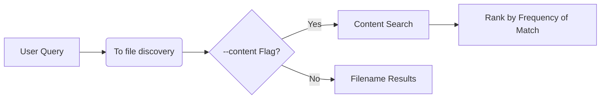

# **SearchLight (Search - Engine) v1.0 Documentation**  
*A CLI Search Tool for Developers*

## **Overview**
SearchLight combines Python with Unix (Ubuntu in my case) tools (`exa` and `grep`) to deliver fast file and content searches from your terminal. Ideal for codebases, documentation, and text-heavy projects.

---

## **Installation**

### **Prerequisites**
- Linux/WSL, macOS, or Unix-like environment
- Python 3.8+
- Git

### **1. Install Dependencies**
```bash
# Linux/WSL (Debian/Ubuntu):
sudo apt update && sudo apt install -y exa python3

# macOS (Homebrew required):
brew install exa python
```

### **2. Clone Repository**
```bash
git clone https://github.com/DhyaanKanoja11/Search---Engine.git
cd Search---Engine
```

### **3. Verify Installation**
```bash
python3 search.py "test" --content
```
*Expected: Lists files containing "test" in names or contents*

---

## **Usage**

### **Basic Search (Filenames Only)**
```bash
python3 search.py "config"
```

### **Content Search (Filenames + Text)**
```bash
python3 search.py "database" --content
```

### **Example Output**
```
🔍 Searching for: 'database' (with content search)

📂 Matching files:
  - ./config/db.yml
  - ./src/database.py

📝 Content matches:
./config/db.yml:
  • host: localhost
  • port: 5432

./src/database.py:
  • def connect_db():
```

---

## **Technical Design**

### **Core Components**
| Component       | Function                     | Technology |
|-----------------|------------------------------|------------|
| File Indexer    | Recursive file listing       | `exa --tree` |
| Results Ranker  | Orders by match relevance    | Python Dict |

### **Workflow**


---

## **Troubleshooting**

| Issue                        | Resolution                   |
|------------------------------|------------------------------|
| `exa: command not found`     | Reinstall via package manager|
| No results returned          | Verify search term matches file patterns |
| Permission errors            | Use `sudo` for installations |

---

## **Roadmap**
- [x] v1.0 - Basic file/content search  
- [ ] v1.1 - Coming Soon!

---

## **Contributing**
I welcome issues and PRs (Click the link below)
[GitHub Repository](https://github.com/DhyaanKanoja11/Search---Engine)

---

## **License**
MIT License --> [LICENSE](https://github.com/DhyaanKanoja11/Search---Engine/blob/main/LICENSE)
